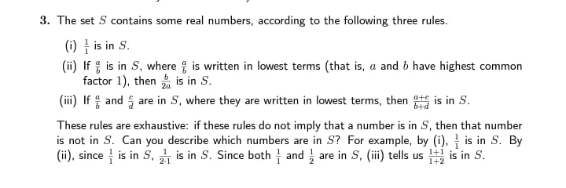
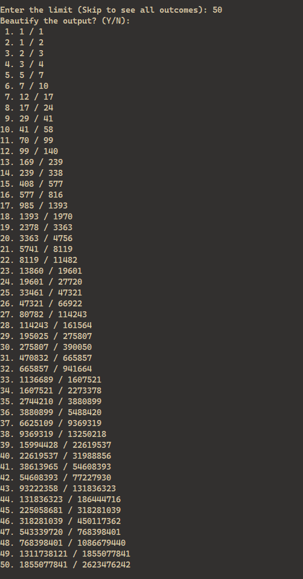

# ➗ Series Gen

Generates a mathematical series

## Question



Run on StackBlitz: [https://stackblitz.com/~/github.com/Jay-Karia/series-gen](https://stackblitz.com/~/github.com/Jay-Karia/series-gen)

## Output

First 50 elements of the series



View more results [here](./results/)

### Development

Install dependencies

```bash
npm install
```

Run development server

```bash
npm run dev
```

Build

```bash
npm run build
```

Start

```bash
npm start
```
