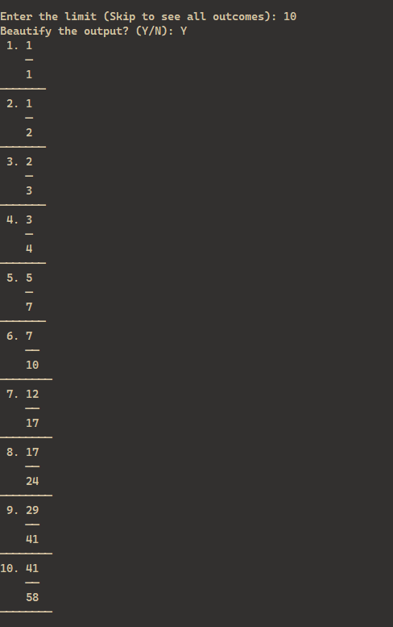

# ➗ Series Gen

Generates a mathematical series

## Question


Run on StackBlitz: [https://stackblitz.com/~/github.com/Jay-Karia/series-gen](https://stackblitz.com/~/github.com/Jay-Karia/series-gen)

## Output

The beautified output for first 10 terms of the series



### Development

Install dependencies

```bash
npm install
```

Run development server

```bash
npm run dev
```

Build

```bash
npm run build
```

Start

```bash
npm start
```
